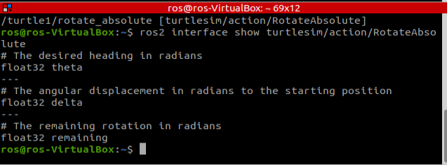

#### Turtle_teleop_key 실행
```
ros2 run turtlesim turtlesim_node
sow2 run turtlesim turtle_teleop_key
```

#### Action list 조회
```
ros2 action list
-> /turtle1/rotate_absolute
```

#### Turtle1/rotate_absolute의 데이터 타입 조회
```
ros2 action list -t
-> turtlesim/action/RotateAbsolte -> /turtle1/rotate_absolute 액션을 사용하기 위해 알아야하는 것들
```


#### Action send_goal 지정
```
ros2 action send_goal /turtle1/rotate_absolute turtlesim/action/RotateAbsolute "{theta: 3.14}"
```
- turtlesim/action/RotateAbsolute라는 데이터 타입을 가진 turtle1/rotate_absolute라는 액션에 3.14를 인가한 것
